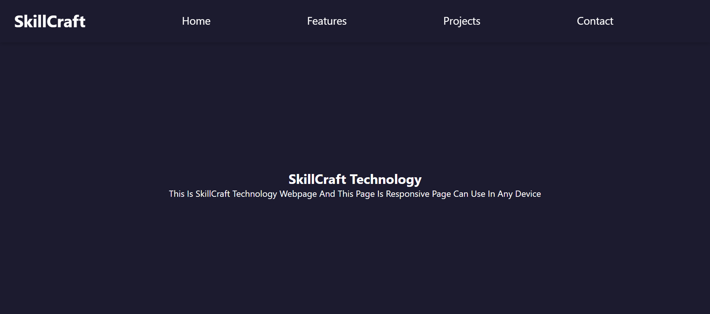

# 🌐 Responsive Landing Page - Task 01

This is a responsive landing page built using **HTML** and **CSS**. It features a fixed navigation bar with hover effects, mobile responsiveness, and a clean layout that adapts to any screen size.

## 🚀 Features

✅ Fixed top navigation bar  
✅ Hover effect on navbar links  
✅ Responsive layout using custom CSS  
✅ Clean and semantic HTML structure  
✅ Fully mobile-friendly  
✅ Simple and modern UI  

## 🖼️ Sections Included

- Home  
- Features  
- Projects  
- Contact  

Each section is accessible via the top navigation bar and is built for responsiveness and clarity.

## 🛠️ Built With

- HTML5  
- CSS3 (No frameworks)

## 🔗 Live Demo

👉 [View Live Demo](https://snehasich.github.io/SCT_WD_1/)

## 📸 Screenshot



## 🔧 Setup & Usage

1. **Clone or Download this repository**
   ```bash
   git clone https://github.com/Snehasich/SCT_WD_1.git
   
2. **Open the project**

   Open index.html in your browser

3. **Customize as needed**
  
   Modify text in index.html
    
   Update styles and responsiveness in style.css
    
   Add more sections or interactive features if required
